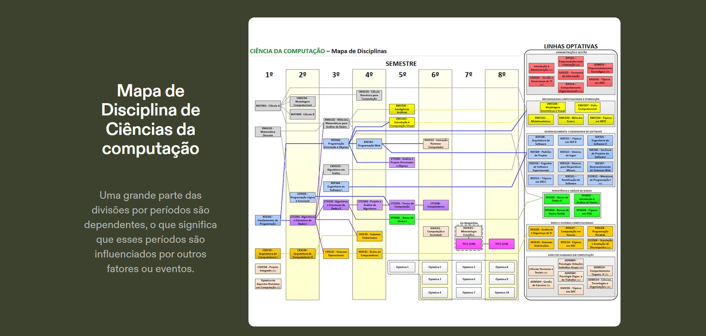
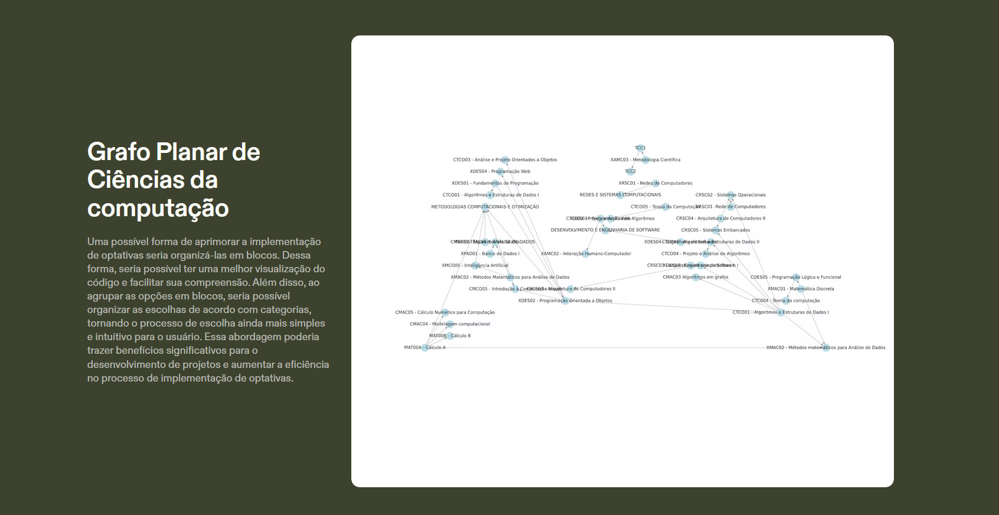

# Repositório da Disciplina **CMAC03 - Algoritmos em Grafos**

## Descrição
Este repositório contém materiais, códigos e recursos desenvolvidos durante a disciplina **CMAC03 - Algoritmos em Grafos**. O foco principal é a implementação e exploração de conceitos fundamentais de grafos, como grafos planares, árvores, busca e representação.

## Conteúdo
- **Artigos**: Materiais de referência e leitura complementar.
- **Imagens**: Visualização de grafos e mapas.
- **Implementações**: Códigos práticos relacionados aos algoritmos estudados.

## Artigo Referente
O artigo utilizado como base pode ser acessado [neste link](https://drive.google.com/file/d/1oiGo_VjwJkffGHWzt7dFHkbrAdhO-BoL/view?usp=sharing).

## Imagens

### 1. Mapa da Grade Curricular CIÊNCIA DA COMPUTAÇÃO

### 2. Grafo de Planaridade

Desenvolvido para a disciplina **CMAC03 - Algoritmos em Grafos**.
